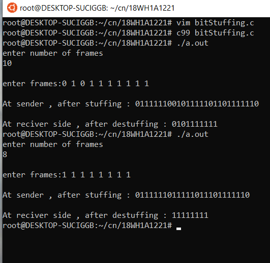

# experiment 1
## AIM : 
To impliment data link layer framing techniques such as bit stuffing.
## procedure:
1.Taking input of number of frames and asking to enter the frames data. 

2.Print the frame data with header and flags transmitted from sender side.

3.print the  frame data without headers and flags from reciver side.

### Output :

