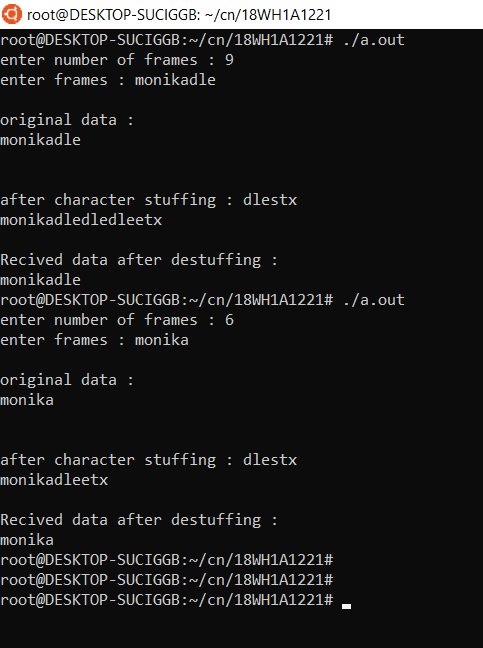

# experiment 1
## AIM : 
To impliment data link layer framing techniques such as character count.
## procedure:
1.Taking input of number of frames and asking to enter the frames data. 

2.Print the frame data with header and flags from sender side.

3.print the frame data without header and flags from reciver side.

### Output :

