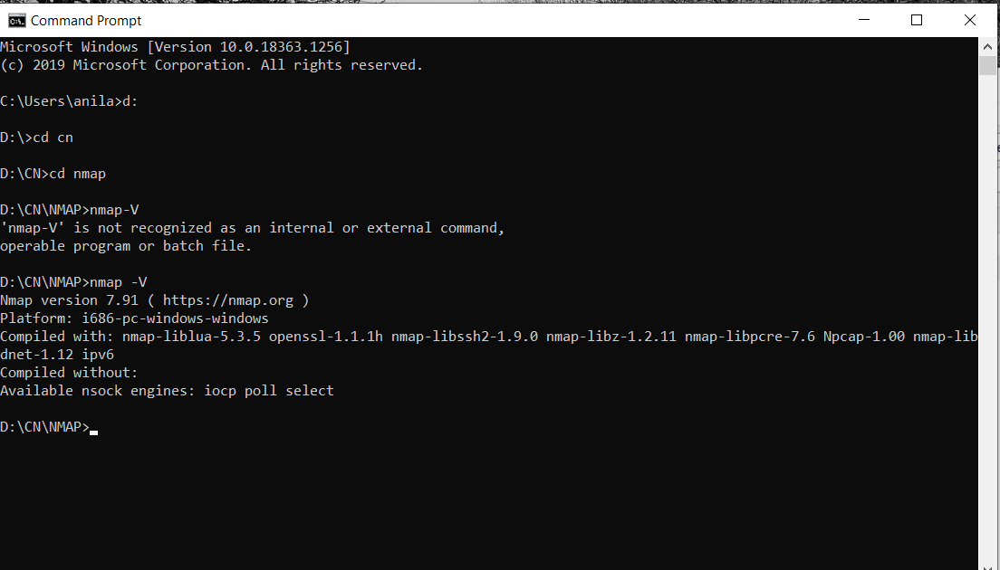

# Experimet 12
## Aim of the Experiment
How to detect Operating System using Nmap

### Steps or Procedure of experiment
Step 1: Go to nmap.org link.

Step 2: Go to download and choose the respective operating system.

Step 3: Download and install Nmap

Step 4: Open command prompt and go to the path of the Nmap directory

Step 5:Then type the command nmap -V

Step 6: This command gives OS type and version as output.

Step 7: Thats how Nmap is used for Operating System detection.

## Output

