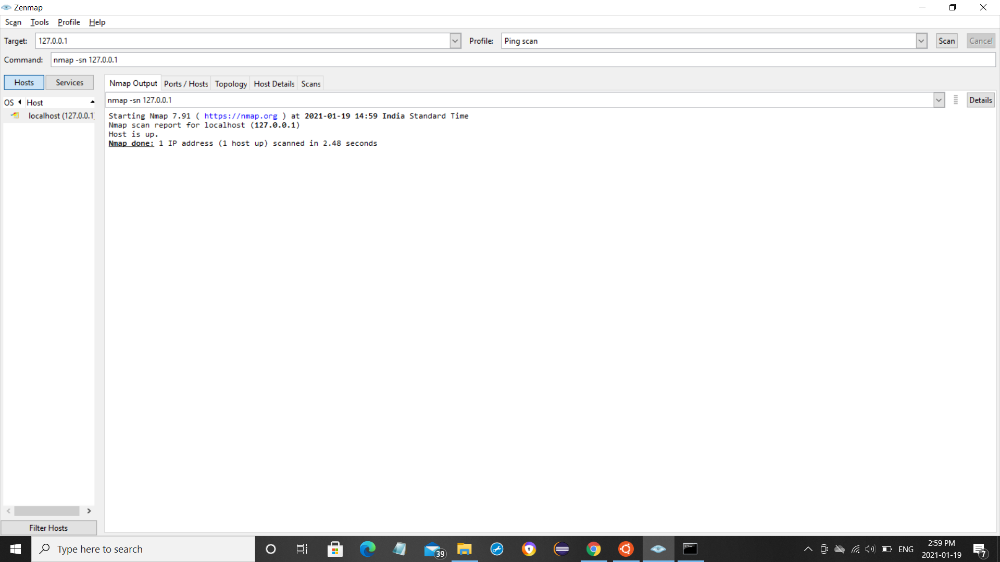
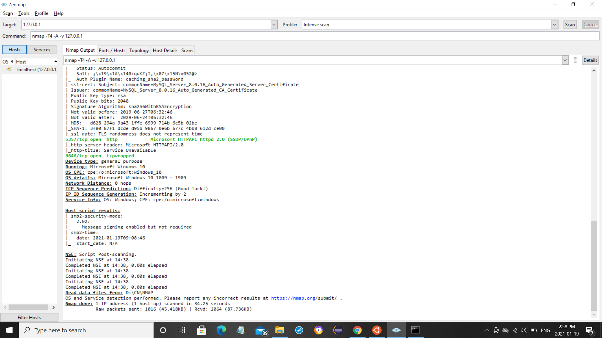

# Experiment 11

## Aim of the Experiment

How to run a Nmap scan

### Steps or Procedure of experiment
Step 1: Go to nmap.org link.

Step 2: Go to download and choose the respective operating system.

Step 3: Download and install Nmap

Step 4: After thae open Nmap and set the IP address as target value and select ping scanin profile section and click on scan.

Step 5: In Nmap output column we can see whether the targets are online or not.It doesnot scan any ports.

Step 6: And now select Intense scan in profile section.

Step 7: In Nmap output column we can see OS version,type of data transmitted.

Step 8: Thats how Nmap scan runs.

## Output
Ping scan

Intense scan

