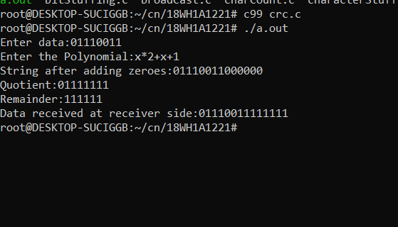

# Experiment 2
## Aim of the Experiment
Write a program to compute CRC code for the polynomials CRC-12,CRC-16 and CRC CCIP

### Steps or Procedure of experiment
#### At sender side-
##### Calculation Of CRC At Sender Side-
1.A string of n 0’s is appended to the data unit to be transmitted.
2.Here, n is one less than the number of bits in CRC generator.
3.Binary division is performed of the resultant string with the CRC generator.
4.After division, the remainder so obtained is called as CRC.
5.It may be noted that CRC also consists of n bits.
##### Appending CRC To Data Unit-
1.The CRC is obtained after the binary division.
2.The string of n 0’s appended to the data unit earlier is replaced by the CRC remainder.
##### Transmission To Receiver-
The newly formed code word (Original data + CRC) is transmitted to the receiver.

#### At Receiver Side-
1.The transmitted code word is received. 2.The received code word is divided with the same CRC generator. 3.On division, the remainder so obtained is checked.

##### If the remainder is zero-
Receiver assumes that no error occurred in the data during the transmission. 2.Receiver accepts the data.

##### If the remainder is non-zero-
Receiver assumes that some error occurred in the data during the transmission. 2.Receiver rejects the data and asks the sender for retransmission.

