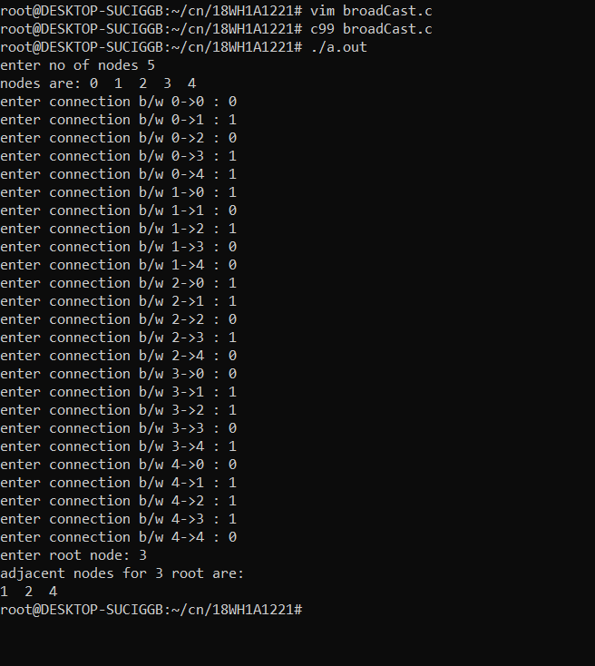

# Experiment 5
## Aim of the Experiment
Write a C program by taking an example subnet of hosts and obtain a broadcast tree for the subnet.

## Steps or Procedure of experiment
#### Broadcast tree
A broadcast sends a message from a specified root processor to all other processors.

Select any edge of minimal value that is not a loop. This is the first edge of T. Select any remaining edge of G having minimal value that does not from a circuit with the edges already included in T. Continue step2 until T contains n-1 edges where n is the number of vertices of G.

## Output
Broadcast tree

