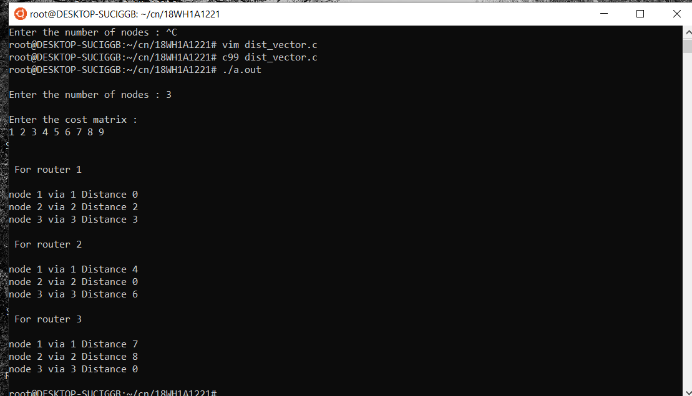

# Experiment 6

## Aim of the Experiment
Write a C program to implement distance vector routing algorithm for obtaining routing tables at each node.

### Steps or Procedure of experiment
Distance vector is Distributed iterative asynchronous simple routing protocol.

### Algorithm
1.A router transmits its distance vector to each of its neighbors in a routing packet.

2.Each router receives and saves the most recently received distance vector from each of its neighbors.

3.A router recalculates its distance vector when:

It receives a distance vector from a neighbor containing different information than before.
It discovers that a link to a neighbor has gone down.
4.From time-to-time, each node sends its own distance vector estimate to neighbors.

5.When a node x receives new DV estimate from any neighbor v, it saves v’s distance vector and it updates its own DV using B-F equation.

#### Formula for calculation: Dx(y) = min { C(x,v) + Dv(y), Dx(y) } for each node y ∈ N

## Output

