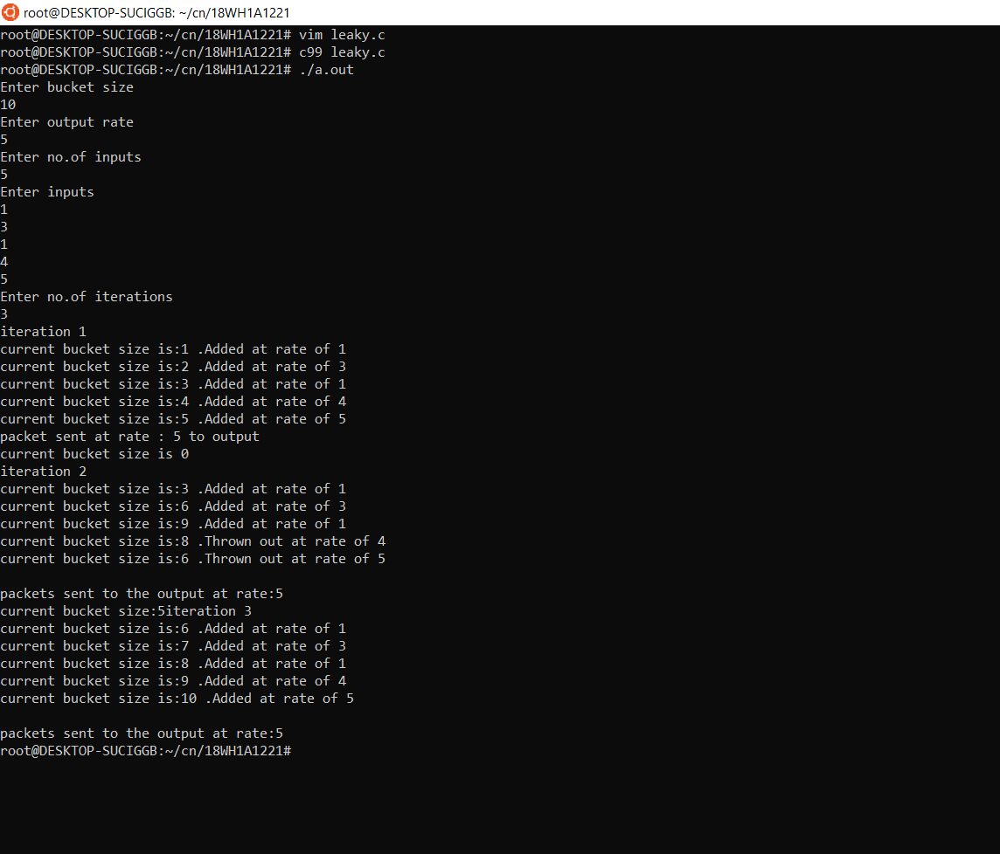

# Experiment 8

## Aim
A program for congestion control using Leaky bucket algorithm.

### Steps or Procedure of experiment
The algorithm works similarly to the way an actual leaky bucket holds water: The leaky bucket takes data and collects it up to a maximum capacity. Data in the bucket is only released from the bucket at a set rate and size of packet. When the bucket runs out of data, the leaking stops. If incoming data would overfill the bucket, then the packet is considered to be non-conformant and is not added to the bucket. Data is added to the bucket as space becomes available for conforming packets.

### Steps
1.Initialize a counter to n at the tick of the clock.

2.If n is greater than the size of the packet, send the packet and decrement the counter by the packet size. Repeat this step until n is smaller than the packet size.

3.Reset the counter and go to step 1.

## Output

